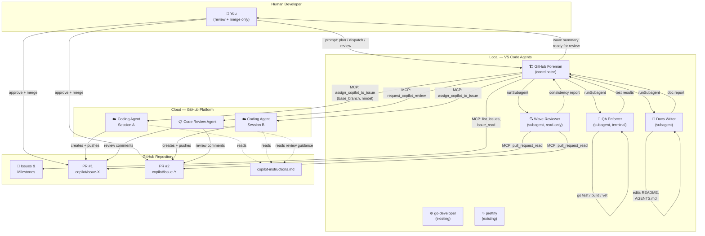
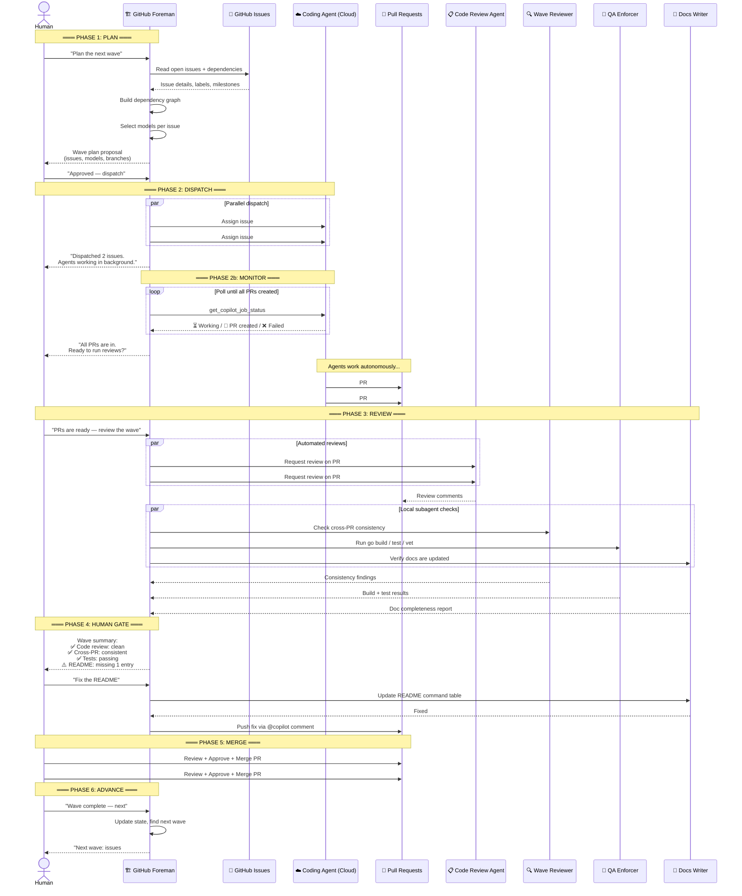

# GitHub Foreman — Workflow Reference

This document contains interaction diagrams and sequential user flows for the GitHub Foreman agent team.

## Agent Interaction Model

This diagram shows which agents run where (local VS Code vs. cloud GitHub) and how they interact with each other, PRs, and the human developer.

## Sequential User Flow

This diagram shows the step-by-step flow a human developer experiences when working with the GitHub Foreman.

## Model Selection Quick Reference

| Issue Type | Recommended Model | Rationale |
|-----------|-------------------|-----------|
| Complex refactor (multi-file, architectural) | Best Claude / reasoning model | Best reasoning for large codebases |
| Docs, help text, straightforward additions | Fastest Codex model | Fast, good for well-scoped work |
| Test generation, coverage improvements | Balanced Codex model | Balanced capability and speed |
| Multiple parallel dispatches | Auto | Avoids rate limiting |
| Unknown / general | **Auto** (default) | Always safe, adapts to available models |

> **Note:** Model availability changes over time. The table above describes *categories* of models, not specific versions. When in doubt, use `Auto` and let the platform choose. The human can always override with a specific model name.
