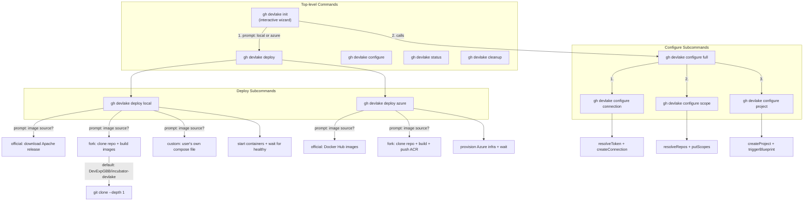

# CLI Architecture — Command Cascade & Flow

## Design Principles

| Principle | Rule |
|---|---|
| **Cascade** | `init` = `deploy` + `configure full`. `configure full` = `connection` + `scope` + `project`. Each level delegates downward. |
| **Self-contained subcommands** | Every subcommand must produce a complete, useful result when run standalone — same prompts, same options, same behavior as when called from a parent orchestrator. |
| **Consistent UX** | Whether you run `gh devlake deploy local` or `gh devlake init → local`, you get the same image-choice prompt with the same options. |
| **Fork-first "custom"** | The "custom/fork" option should default to cloning a fork (with `DevExpGBB/incubator-devlake` as the suggested default). This applies to both local and Azure paths symmetrically. |
| **Quiet mode for orchestrators** | Parent commands suppress child summaries via `--quiet` / internal flags, then print their own consolidated summary at the end. |
| **Flag passthrough** | Orchestrators set child flags before calling `RunE`, never duplicate logic that belongs in the child. |

## Command Tree

```
gh devlake
├── init                          # Interactive wizard (deploy + configure full)
├── deploy
│   ├── local                     # Docker Compose on this machine
│   └── azure                     # Azure Container Apps
├── configure
│   ├── full                      # connection + scope + project in one session
│   ├── connection                # Single plugin connection CRUD
│   │   ├── (default: create)
│   │   ├── list
│   │   ├── update
│   │   ├── delete
│   │   └── test
│   ├── scope                     # Manage scopes on connections
│   │   ├── add                   # Add repo/org scopes to a connection
│   │   ├── list                  # List scopes on a connection
│   │   └── delete                # Remove a scope from a connection
│   └── project                   # Create project + blueprint + trigger sync
├── status                        # Health check + connection summary
└── cleanup                       # Tear down (local or Azure)
```

## Ideal Cascade Flow

Check if code architecture reflects this ideal flow. If not suggest modifications to align with these principles.



## Image Source Options (must be symmetric)

Both `deploy local` and `deploy azure` should offer the same three-way choice when the user hasn't explicitly set flags:

| Option | Local behavior | Azure behavior |
|--------|---------------|----------------|
| **official** (default) | Download `docker-compose.yml` + `env.example` from Apache GitHub release | Use official images from Docker Hub, no ACR needed |
| **fork** | Clone repo (default `DevExpGBB/incubator-devlake`), `docker compose build` from source | Clone repo, build images, push to ACR |
| **custom** | User provides their own `docker-compose.yml` in the target dir | User provides pre-built images or custom Dockerfile |

## Refactoring Checklist

When restructuring commands to match the target architecture:

1. **Move image-choice prompt into `runDeployLocal`** — when `--official` flag isn't explicitly set by the user, prompt with 3 options (official / fork / custom). The fork option clones the repo (reuse `newGitClone` from `deploy_azure.go`), builds images, then proceeds.

2. **Move container startup into `runDeployLocal`** — add a `--start` flag (default `true` in interactive, `false` in CI). `init` no longer calls `startLocalContainers` separately.

3. **Make `runInitLocal` thin** — it sets flags/defaults and calls `runDeployLocal`. The git-repo warning and dedicated-directory prompt can stay in `init`, but everything else delegates down.

4. **Make `init` Phase 2–4 call `configure full`** — instead of duplicating the connection/scope/project flow inline in `init.go`, call `runConfigureFull` (or share the same internal orchestrator).

5. **Align the 3 image-source options** between local and Azure paths so both offer official / fork / custom with consistent labels.

## Key Files

| File | Responsibility |
|------|---------------|
| `cmd/init.go` | Top-level wizard — should be thin, delegates to deploy + configure full |
| `cmd/deploy.go` | Parent command, registers `local` and `azure` subcommands |
| `cmd/deploy_local.go` | `runDeployLocal` — owns image-choice, file download/clone, container startup |
| `cmd/deploy_azure.go` | `runDeployAzure` — owns image-choice, Azure provisioning |
| `cmd/configure.go` | Parent command, registers subcommands |
| `cmd/configure_full.go` | `runConfigureFull` — orchestrates connection + scope + project |
| `cmd/configure_connections.go` | Single-plugin connection CRUD |
| `cmd/configure_scopes.go` | Scope management per plugin |
| `cmd/configure_projects.go` | Project + blueprint creation |
| `cmd/connection_types.go` | `ConnectionDef` registry — single source of truth for plugins |
| `cmd/helpers.go` | Shared utilities (banners, git-repo detection, etc.) |
